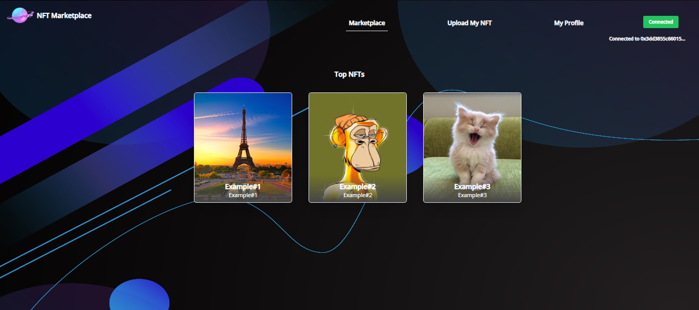
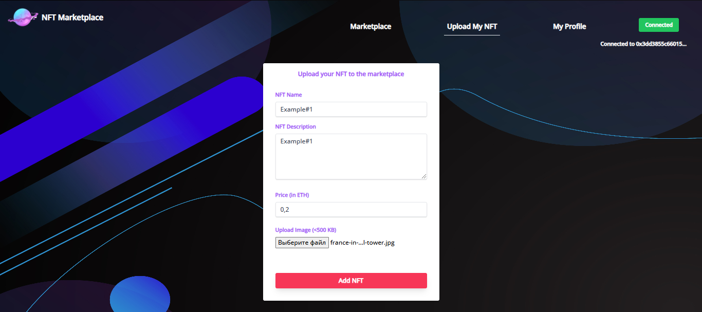
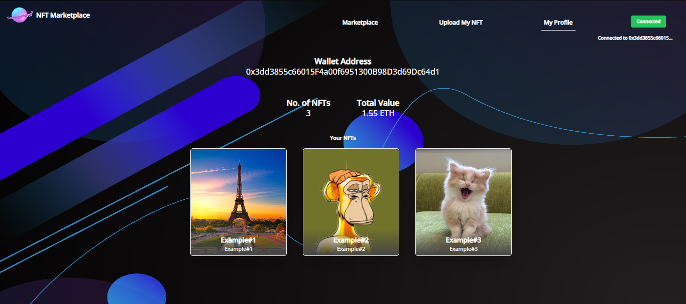

# NFT Marketplace

Welcome to the **NFT Marketplace**, a decentralized platform for minting, buying, selling, and managing NFTs securely on the blockchain. This project is designed to showcase the functionalities of a fully featured NFT marketplace, with enhanced smart contract capabilities for listing, updating, and purchasing NFTs.


## Features

- **Mint NFTs**: Easily create NFTs with metadata stored on IPFS.
- **Buy and Sell**: List NFTs for sale, purchase them, and manage your listings.
- **Update Price**: Sellers can modify the price of their listed NFTs.
- **Secure Transactions**: Ensures safe and reliable transfers of NFTs and payments.
- **Frontend Integration**: Seamless user interface to interact with the blockchain.


## Technology Stack

- **Frontend**: React.js for the user interface
- **Backend**: Node.js with Express.js for API interaction
- **Blockchain**: Solidity smart contracts on Ethereum-compatible networks
- **Storage**: IPFS for metadata
- **Development Tools**:
  - Hardhat for smart contract development
  - Web3.js or ethers.js for blockchain interaction
  - Mocha and Chai for testing


## Screenshots

### 1. Marketplace


### 2. Listing NFT


### 3. Profile page


### 4. Individual NFT
.png)
.png)

## How to Run the Project

1. **Update the .env and hardhat.config.js files**

2. **Install Dependencies**:
   ```bash
   npm install

3. **Compile Smart Contracts**:
   ```bash
   npx hardhat compile

4. **Deploy Smart Contract**:
   ```bash
   npx hardhat run --network ganache scripts/deploy.js

5. **Start the Frontend**:
   ```bash
   npm start
